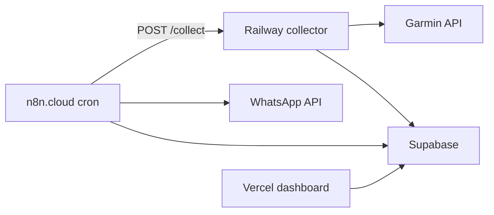

# Despliegue 100% cloud

El MVP **no requiere tu Mac encendido**. El worker local fue solo el camino más rápido para probar; la arquitectura objetivo es cloud.

## Por qué no es “todo Vercel serverless”

Garmin Connect exige **sesión persistente** (tokens OAuth + refresh). Eso no encaja en funciones edge/serverless que arrancan frías y no guardan estado.

Lo que sí es cloud:

| Componente | Servicio cloud | Rol |
|------------|----------------|-----|
| Collector API | **GitHub Actions** (cron) o Railway/Fly.io | Sin Mac; tokens en GitHub Secrets |
| Base de datos | **Supabase** | Snapshots, readiness, mensajes |
| Orquestación | **n8n.cloud** | Cron 06:00/07:00, WhatsApp, alertas |
| Dashboard | **Vercel** | Read-only desde Supabase |
| WhatsApp | Twilio / Meta Cloud API | Canal coaching |



## 1. Supabase (cloud)

1. Crear proyecto `fitness-coach-diego`
2. Ejecutar `supabase/schema.sql` + `supabase/seed.sql`
3. Guardar `SUPABASE_URL` y `SUPABASE_SERVICE_ROLE_KEY`

## 2. Collector en GitHub Actions (ya configurado)

Workflow: `.github/workflows/coaching-daily-collect.yml` — cron **06:00 Bogotá** diario.

Secrets en el repo (ya cargados):
- `SUPABASE_URL`, `SUPABASE_SERVICE_ROLE_KEY`
- `GARMINTOKENS_B64` (tokens Garmin)

Disparo manual: GitHub → Actions → Coaching Daily Collect → Run workflow.

---

## 2b. Collector en Railway (alternativa)

### Variables de entorno

```
SUPABASE_URL=https://xxx.supabase.co
SUPABASE_SERVICE_ROLE_KEY=eyJ...
GARMIN_EMAIL=tu@email.com
GARMIN_PASSWORD=...
GARMINTOKENS=/data/garmin-tokens
COLLECTOR_PORT=8080
```

Montar **volumen persistente** en `/data/garmin-tokens` para que los tokens Garmin sobrevivan redeploys.

### Bootstrap tokens (una vez)

Opción A — login local → subir tokens:

```bash
# En tu Mac (una sola vez)
python scripts/refresh_garmin_session.py
tar czf garmin-tokens.tgz -C ~/.garminconnect .
# Subir garmin-tokens.tgz al volumen Railway en /data/garmin-tokens
```

Opción B — credenciales en env: Railway hace login en el primer `/collect`. Si Garmin pide MFA, hay que completar el login una vez (logs Railway o script local).

### Deploy

```bash
# Con Railway CLI
railway up
```

O conectar el repo GitHub a Railway; usa `Dockerfile` + `railway.toml`.

URL pública: `https://garmin-collector-production.up.railway.app`

## 3. n8n.cloud

Importar `docs/n8n/*.json`.

Variables:

```
COLLECTOR_URL=https://garmin-collector-production.up.railway.app
SUPABASE_URL=...
SUPABASE_SERVICE_ROLE_KEY=...
WHATSAPP_TO=+57...
WHATSAPP_API_URL=...
```

## 4. Vercel (dashboard)

```bash
cd apps/web
vercel --prod
```

Env: `NEXT_PUBLIC_SUPABASE_URL`, `NEXT_PUBLIC_SUPABASE_ANON_KEY`

## Qué eliminar del Mac

Una vez Railway + n8n + Supabase estén activos:

- No necesitas `scripts/start_collector.sh` corriendo
- No necesitas cron local
- Opcional: ngrok/Cloudflare tunnel

Tu Mac solo sirve para **bootstrap inicial de tokens Garmin** o refresh si expiran (WF4 alerta token).

## Coste orientativo (MVP single-user)

| Servicio | Tier |
|----------|------|
| Supabase | Free |
| Railway | ~$5/mes (worker + volume) |
| n8n.cloud | Free / Starter |
| Vercel | Free |
| Twilio WhatsApp | Pay per message |
